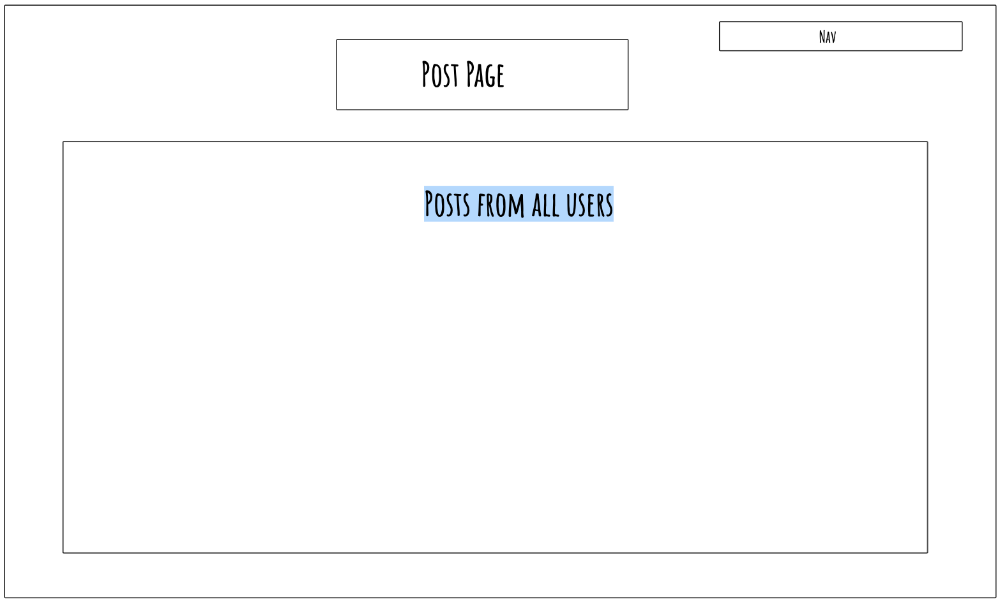

## Requirements

🎯 Use Clerk.com to set up user signup and login.

🎯 Use the Clerk userId to associate posts with a user.

🎯 Enable each user to create a profile associated with their userId, and a form to input their biography and location data, etc. with a URL similar to /user/[userId].

🎯 Enable users to create posts associated with the userId, and display those posts on the user's profile page

🎯 Show a 404 error if a user profile doesn't exist

🎯 Use at least 1 Radix UI Primitive or similar

## Reflection Requirements

🎯 Please mention the requirements you met and which goals you achieved for this assignment.

🎯 Were there any requirements or goals that you were not quite able to achieve?

🎯 If so, could you please tell us what was it that you found difficult about these tasks?

# My Reflection

I found using clerk to be a good learning experience, I struggled initially with getting the hang of auth and current user but I was able to get to grips with it pretty quickly.
Writing the sql queries to get posts associated with user wasn’t too hard, setting up the databases went a lot better this time round but I need to better understand the many to many relationship to be able to implement this and use it effectively.
I didn’t struggle with creating the forms to be able to input data for the user profile or for the posts but what I did struggle with was hiding the form for the profile data on the profile once this had been filled out or making it show if they had not not filled it out. With some rubber ducking I was able to implement this and although I understand it I do feel its something I need more practise with.
I made a posts timeline to display all posts from every user and then also in the profile I made it so the posts a user has made can be deleted but they can only do this from their profile not from the posts timeline. I did have some initial struggle with deleting a singular comment but just realised it was syntax error in the sql so I managed to fix it pretty quickly.
I added in an edit for the profile data and managed to implement the defaultValue that I didn’t get the opportunity to do last week, I find its much more effective now.
I added in a not found page and also an error page, I added links into the error page to be able to direct users to the sign-up/in pages or back to home.
I did struggle with the radix-ui primitives, I tried to implement quite a few but was unable to do some of the ones I wanted but I did manage to get a hover card working on the profile for some basic tips. I also added a theme to my page, after some initial quirks with different syntax I did find it to be quite useful and quite enjoyed playing around with it, given some more time I would of liked to style my page a lot more and attempt a few more of the stretch goals but I did manage to do the one stretch goal of a user not being able to leave their biography blank, if they had not filled it in they would not be able to make posts or see their profile. Also given more time I’d of liked to have implemented dynamic metadata and also add more form inputs for the bio to have abit more of shown in their profile. I’d also have liked to play around with the avatars a lot more but I was really trying to focus on getting the main requirements done so when I come back to the project I will attempt doing some of these and trying to implement more of the stretch goals.
Overall I think my app although functional is quite bare and could be improved a lot more with better styling and more features so I look forward to being able to improve it in the future

# Images for this assignment

